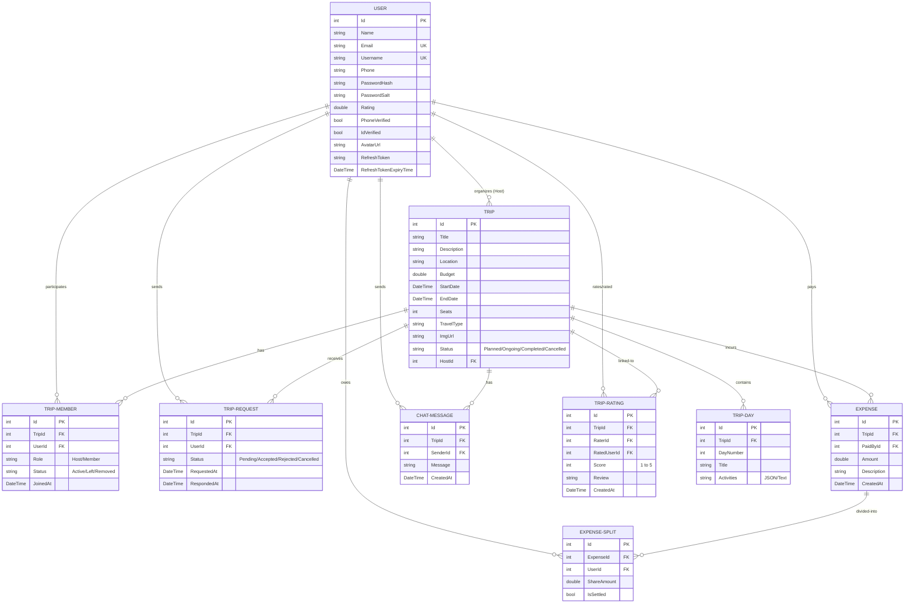

# TripConnect — Full-Stack System Design Document

This document serves as the comprehensive architectural blueprint and system design reference for **TripConnect**, a collaborative group travel platform. It details all layers of the application, database design, API routing, JWT authentication, and the deep-dive integration of Redis distributed caching.

---

## 1. System Architecture Overview

TripConnect is designed as a decoupled, multi-layered full-stack application. It leverages an Angular Single Page Application (SPA) on the frontend, an ASP.NET Core Web API on the backend adhering to Clean Architecture principles, and a dual-data storage strategy utilizing a relational database (SQL Server/Postgres) alongside a high-performance distributed cache (Redis).

```mermaid
graph TD
    %% Client Tier
    subgraph Client_Tier [Client Tier]
        Angular[Angular 17+ SPA]
        AuthInterceptor[Auth Interceptor]
        AuthGuard[Auth Guard]
    end

    %% API Gateway / Entry Tier
    subgraph API_Tier [API Layer - entry point]
        Controllers[API Controllers]
        AuthMiddleware[JWT Bearer Middleware]
        ErrorHandler[ErrorHandling Middleware]
    end

    %% Logic Tier
    subgraph Application_Tier [Application Layer - Business Logic]
        Services[Application Services]
        AutoMapper[AutoMapper Mappings]
        DTOs[Data Transfer Objects]
    end

    %% Data Orchestration Tier
    subgraph Domain_Tier [Domain Layer - Enterprise Core]
        Entities[Domain Entities]
        RepoContracts[Repository Contracts]
        UoW[Unit of Work Contract]
    end

    %% Data Adapter Tier
    subgraph Infrastructure_Tier [Infrastructure Layer - Adapters]
        EFCore[EF Core DbContext & Repositories]
        RedisCache[Redis Cache Repositories]
        ExternalAPIs[Twilio, SendGrid, ImageKit Clients]
    end

    %% Data Storage Tier
    subgraph Storage_Tier [Storage Tier]
        SQLDB[(SQL Server Database)]
        RedisCloud[(Redis Distributed Cache)]
        ImageKitCDN[ImageKit Image CDN]
    end

    %% Connections
    Angular -->|HTTP / REST + JWT| Controllers
    AuthInterceptor -.->|Injects JWT Bearer| Angular
    AuthGuard -.->|Guards Protected Routes| Angular
    
    Controllers --> Services
    AuthMiddleware -.->|Validates Tokens| Controllers
    ErrorHandler -.->|Catches Exceptions| Controllers

    Services --> RepoContracts
    Services --> Entities
    Services --> RedisCache

    EFCore --|> RepoContracts
    RedisCache --|> RepoContracts

    EFCore --> SQLDB
    RedisCache --> RedisCloud
    ExternalAPIs --> ImageKitCDN
```

---

## 2. Multi-Layer Design

TripConnect implements a strict **Clean Architecture** (Dependency Inversion principle). Dependencies only point inward:
- **Domain Layer** has zero dependencies on databases, frameworks, or other projects.
- **Application Layer** depends only on Domain.
- **Infrastructure Layer** depends on Application and Domain, implementing the interfaces defined in those layers.
- **API Layer** acts as the entry point and orchestrates Dependency Injection, depending on Application and Infrastructure.

### 2.1 User Interface Layer (Angular SPA)
The frontend uses Angular standalone components. It handles user interactions, client-side routing, local token storage, and communicates with the backend via REST endpoints.
- **`AuthGuard`**: Restricts unauthorized users from entering protected components (`/create`, `/profile`, `/trip/:id`, etc.), redirecting them to `/login`.
- **`AuthInterceptor`**: Hooks into the Angular `HttpClient` pipeline to automatically inject the Bearer JWT token (`tc_token`) stored in `localStorage` into all outgoing HTTP headers.
- **State Management & Services**: Core services (`auth.service.ts`, `trip.service.ts`, `expense.service.ts`) expose RxJS Observables to handle reactive data flow to UI components.

### 2.2 API Entry Layer (ASP.NET Core Web API)
The entry point maps incoming HTTP requests to controller routes, coordinates middleware pipeline execution, and handles response serialization.
- **`ErrorHandlingMiddleware`**: Intercepts all unhandled exceptions globally, logging the stack traces internally via Serilog, and returning unified RFC 7807-compliant JSON error responses with proper HTTP status codes.
- **Authentication Filter**: Configures JWT Bearer validation middleware (`TokenValidationParameters`) with strict settings, checking expiration, issuer, audience, and signature.
- **Controllers**: Thin controllers that act strictly as routing/payload routing structures, forwarding operations to Application Services.

### 2.3 Application Layer (Business Logic)
This layer defines the behavior of the system, coordinates transactions, and maps domain entities to client-facing Data Transfer Objects (DTOs).
- **Service Implementations**: Services like `TripService` or `ExpenseService` apply business rules (e.g., verifying that a user is an approved group member before allowing them to post messages or log expenses).
- **AutoMapper Profiles**: Predefined mapping rules that transfer data efficiently between Domain Entities and DTOs (e.g., masking user password hashes in profiles).
- **Orchestrations**: Handles automatic expense splits across all active members when a new expense is logged.

### 2.4 Domain Layer (Core Business Domain)
Contains the enterprise business model, core business rules, enumerations, and repository interfaces.
- **Pure Entities**: Represents tables and objects with relations (e.g., `User`, `Trip`, `TripMember`).
- **Interfaces**: Defines contracts for persistence (`ITripRepository`, `IUserRepository`, etc.) and the unit of work transaction manager (`IUnitOfWork`).

### 2.5 Infrastructure Layer (Adapters & Integrations)
Bridges Domain contracts to real-world infrastructure databases, caching systems, and external REST APIs.
- **EF Core DB Context**: Configures SQL Server database tables, seed data, mapping specifications, and executes actual SQL commands.
- **External Integration Adapters**: Implements `IImageService` via ImageKit REST API, `ISmsService` via Twilio Verify API, and `IEmailService` via SMTP/Gmail client.
- **Cache Adapter**: Plugs StackExchange.Redis implementation into Domain caching contracts.

---

## 3. Redis Caching Architecture

Redis is utilized as a high-performance distributed cache to reduce database load, minimize API latency, and maintain fast response times for read-heavy operations.

```
                  +--------------------------------+
                  |       Client Request           |
                  +----------------+---------------+
                                   |
                                   v
                  +----------------+---------------+
                  |      ICacheService.GetAsync    |
                  +----------------+---------------+
                                   |
                             [Cache Hit?]
                             /          \
                           YES           NO
                           /              \
                          v                v
                  +-------+------+  +------+-------+
                  | Return Cached|  | Database SQL |
                  |    Object    |  |  Query Read  |
                  +--------------+  +------+-------+
                                           |
                                           v
                                    +------+-------+
                                    | Set Cache    |
                                    | (With Tags)  |
                                    +------+-------+
                                           |
                                           v
                                    +------+-------+
                                    | Return Fresh |
                                    |    Object    |
                                    +--------------+
```

### 3.1 Connection Management
We manage the connection to Redis using the `StackExchange.Redis` `IConnectionMultiplexer` as a registered Singleton. This ensures a single TCP socket pool is shared across the entire web application host, reducing connection overhead and ensuring thread-safe concurrency.

### 3.2 Caching Strategy: Cache-Aside (Read-Through)
The `CacheService.GetOrSetAsync<T>` method implements the Cache-Aside pattern:
1. An incoming request checks Redis for the given key.
2. **Cache Hit**: Data is deserialized from JSON and returned immediately.
3. **Cache Miss**: The factory delegate is executed (querying SQL Server), the result is serialized into JSON, cached in Redis with an configured TTL, and returned.

### 3.3 Cache Keys, Expiration, and TTL Conventions
To avoid key collisions, keys are namespace-prefixed with `tripconnect:` and structured logically:

| Cache Object | Key Pattern | TTL (Absolute) | TTL (Sliding) | Invalidation Event / Target Tags |
|---|---|---|---|---|
| User Profile | `tripconnect:user:profile:{userId}` | 1 Hour | 30 Mins | Profile Update, ID/Phone Verification (`user:all`) |
| Trip Details | `tripconnect:trip:details:{tripId}` | 1 Hour | 30 Mins | Trip edit, Trip cancellation, itinerary update (`trip:{tripId}`) |
| Active Trip Members | `tripconnect:trip:members:{tripId}` | 1 Hour | 30 Mins | Join request approved, user leaving trip (`trip:{tripId}:members`) |
| Trip Expense List | `tripconnect:expense:trip:{tripId}` | 30 Mins | 15 Mins | Expense added, split settled (`trip:{tripId}:expenses`) |
| Chat History | `tripconnect:chat:history:{tripId}:{page}` | 30 Mins | — | New chat message sent (`chat:{tripId}`) |

### 3.4 Tag-Based Invalidation System
To invalidate grouped caches efficiently without using computationally expensive wildcard searches (like `KEYS` command in Redis, which blocks the single-threaded Redis engine), TripConnect implements a Tag-Based Invalidation System using Redis **Sets**.

- **Structure**:
  - `tag:<tag_name>`: Redis Set storing all full cache keys bound to that tag.
  - `key_tags:<cache_key>`: Redis Set storing all tags associated with a specific key.
- **Workflow**:
  - When saving an object (e.g., `tripconnect:trip:details:42`), we specify associated tags: `trip:42`, `trip:all`.
  - In Redis, the set `tag:trip:42` is updated to include the key `tripconnect:trip:details:42`.
  - When the trip is updated, we call `InvalidateByTagAsync("trip:42")`. The service retrieves all keys listed in the Redis Set `tag:trip:42`, issues an atomic `KeyDeleteAsync` command for each of them, and then deletes the Set `tag:trip:42` itself.

### 3.5 Resilience and Fault Tolerance (Fail-Open)
Redis is treated as a non-volatile booster layer. The cache wrapper implements strict **try-catch blocks** on all Redis socket operations:
- If Redis becomes unavailable (e.g., network timeout, cloud connection reset), the cache wrapper logs a Warning via Serilog and falls back directly to the relational database.
- This prevents a Redis outage from taking down the entire API, ensuring high availability (Fail-Open mode).

### 3.6 Cache Warmup and Cleanup
- **`CacheWarmingService`**: A hosted startup task that queries SQL Server for popular, high-volume data (such as upcoming featured trips, verified organizer details, and general active listings) and pre-populates Redis on application startup.
- **`CacheCleanupBackgroundService`**: A hosted background worker (`IHostedService`) that triggers every 60 minutes to flush dangling keys, remove expired tag lists, and keep the memory usage of the Redis cluster within optimal bounds.

---

## 4. Database Design & Entity Relationships

The relational database acts as the single source of truth for transactional data consistency.

### 4.1 Entity Relationship Diagram (ERD)



---

## 5. Security & Authentication Design

TripConnect implements defense-in-depth principles to protect user data, secure endpoints, and verify identities.

```
       [Client SPA]                           [API Server]
            |                                       |
            |---- 1. POST /api/user/login --------->|
            |                                       | (Validate Hash + Salt)
            |<--- 2. Returns Access + Refresh ------|
            |        (JWT Bearer)                   |
            |                                       |
  (Store tokens in local)                           |
            |                                       |
            |---- 3. HTTP Request + Bearer JWT ---->|
            |        (Authorization Header)         | (Middleware decodes & validates)
            |<--- 4. HTTP 200 OK (Data Response) ---|
            |                                       |
```

### 5.1 Password Hashing Strategy
- Plaintext passwords are never stored.
- On registration, we generate a cryptographically secure random 16-byte **Salt** using `RNGCryptoServiceProvider`.
- The password is brand-hashed using the **HMAC-SHA512** algorithm alongside this user-specific salt.
- Both the resulting `PasswordHash` (64 bytes) and `PasswordSalt` (128 bytes) are stored in the SQL database.
- Login validation runs the same hashing function on the incoming plaintext password using the retrieved salt and uses constant-time comparison to verify matches.

### 5.2 JWT Authentication Cycle
1. **Access Token**: Short-lived cryptographic token valid for **60 minutes**. Signed with HS256 using a 256-bit configuration secret key. Stores essential claims: `NameIdentifier` (userId), `Email`, `Name`, and phone details.
2. **Refresh Token**: A cryptographically random 32-byte string stored in the database. Valid for **7 days**. Used by the client to obtain a new Access Token once it expires, preventing the user from needing to re-enter credentials constantly.

### 5.3 Token Revocation & Blacklisting
- **Database Level**: On logout or user account changes, the stored `RefreshToken` is immediately set to null in the user database table.
- **API Level**: Users have an `IsTokenBlacklisted` database flag. When flagged, the API blocks requests from that user, even if the current Access Token has not expired yet.

---

## 6. End-to-End Execution Flows

### Scenario A: User Login & Token Storage
1. Angular client captures inputs and makes a `POST /api/user/login` call.
2. The `UserController` hands the credentials to `UserService`.
3. `UserService` queries `UserRepository` for the user record.
4. Passwords are validated using the matching password salt.
5. `TokenService` builds the JWT Access Token and generates a secure random Refresh Token.
6. The database is updated with the new `RefreshToken` and its expiry timestamp.
7. The API sends a `200 OK` response containing `accessToken`, `refreshToken`, and user metadata DTO.
8. The Angular client writes these values to local storage under `tc_token`, `tc_refresh_token`, and `tc_userId`.

### Scenario B: Trip Creation & Cache Invalidation
1. The user creates a trip on the Angular frontend.
2. A `POST /api/trip` request is sent, including the JWT access token in the request header.
3. The `authInterceptor` passes the token, and the API `Authorize` middleware validates the signature and extracts the `UserId`.
4. `TripController` coordinates the call to `TripService.CreateTripAsync()`.
5. The `Trip` entity is built and saved to SQL Server using EF Core via the `UnitOfWork` transaction.
6. `TripService` clears the cached trip lists by calling:
   - `_cacheService.RemoveAsync(CacheKeyConstants.TRIP_ALL)`
   - `_cacheService.InvalidateByTagAsync("trip:all")`
7. A `201 Created` status is returned to the client, and the UI redirects the user to the newly posted trip.

### Scenario C: Expense Split Workflow
1. A trip member enters a shared expense of $120.00 for a shared dinner.
2. The Angular client sends a `POST /api/expense` request.
3. `ExpenseController` calls `ExpenseService.CreateExpenseAsync()`.
4. The service fetches all active trip members in group: Host, User B, User C.
5. The logic splits the cost equally ($40.00 each) and creates `ExpenseSplit` records:
   - Host: $40.00 (marked as settled since they paid)
   - User B: $40.00 (unsettled)
   - User C: $40.00 (unsettled)
6. The `Expense` and `ExpenseSplits` are saved to the database.
7. The service invalidates the expense caches:
   - `_cacheService.InvalidateByTagAsync("trip:42:expenses")`
   - `_cacheService.RemoveAsync("expense:summary:42")`
8. The updated expense summary is recalculated on the next read request and cached for future requests.
